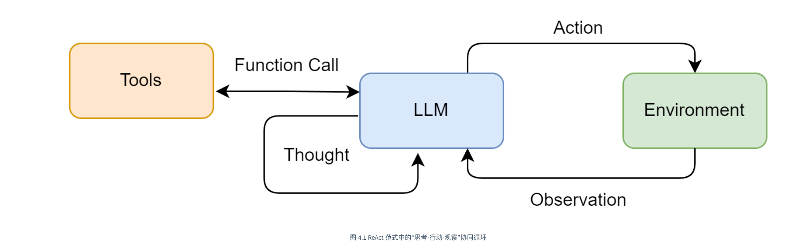
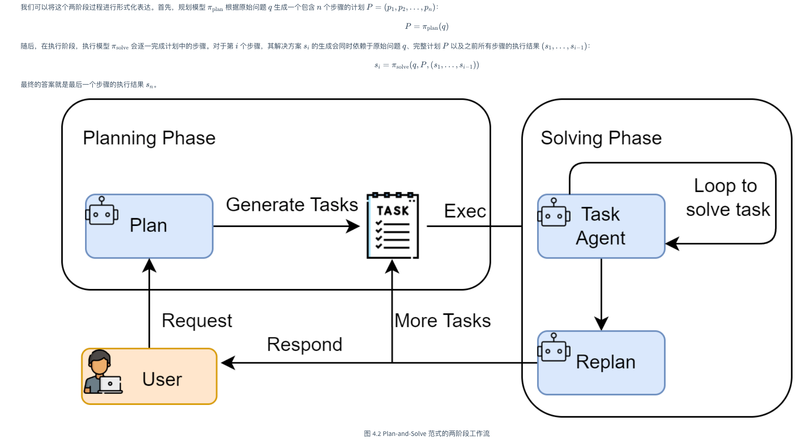
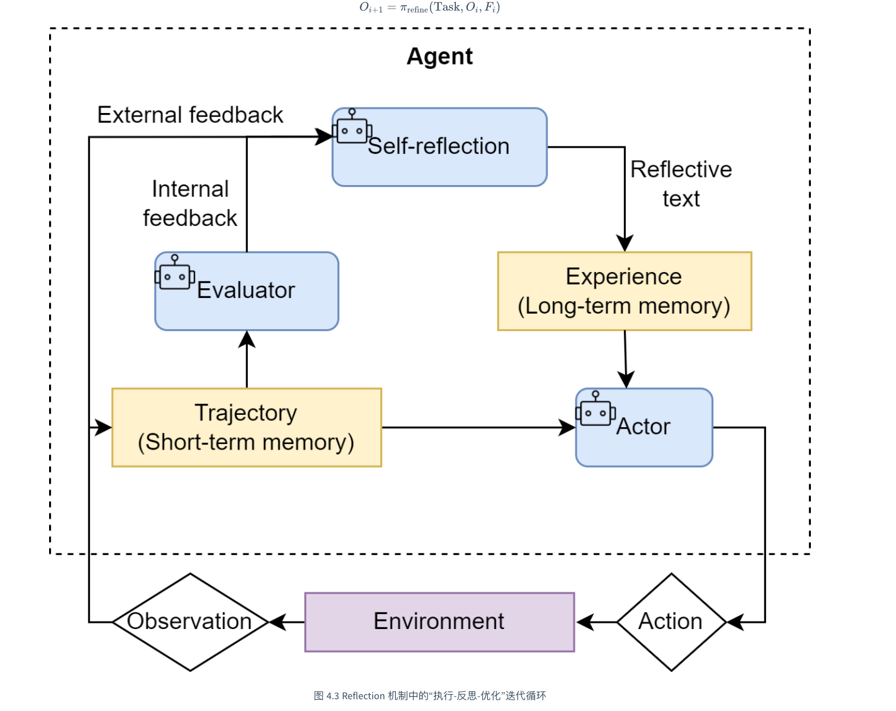

# agents-tutorial

一个用于学习和演示 Agent 常见范式的 Python 项目，包含：
- LLM 基础调用（流式输出）
- ReAct（Reason + Act）
- Plan-and-Solve（先规划后执行）
- Reflection 机制说明

## 环境要求

- Python `>=3.12`
- `uv`（推荐）

## 安装依赖

在项目根目录执行：

```bash
uv sync
```

## 环境变量配置

在项目根目录创建 `.env`：

```env
LLM_MODEL_ID=your_model_id
LLM_API_KEY=your_api_key
LLM_BASE_URL=your_base_url
LLM_TIMEOUT=60

# ReAct 搜索工具（可选）
USE_MOCK_SEARCH=1
SERPAPI_API_KEY=your_serpapi_key
```

说明：
- `USE_MOCK_SEARCH=1`：默认使用本地 Mock 搜索数据（离线可跑）
- `USE_MOCK_SEARCH=0`：启用 SerpApi 真搜索（需配置 `SERPAPI_API_KEY`）

## 运行示例

建议先进入 demo 目录运行（当前代码使用同目录导入）：

```bash
cd agents_tutorial/llm_demo
python llm_client.py
python react.py
python plan_and_solve.py
```

## 目录说明

- `agents_tutorial/llm_demo/llm_client.py`：统一 LLM 客户端，支持流式输出
- `agents_tutorial/llm_demo/react.py`：ReAct 智能体与 `Search` 工具（含 Mock 回退）
- `agents_tutorial/llm_demo/plan_and_solve.py`：规划器 + 执行器
- `agents_tutorial/llm_demo/reflection_demo.py`：Reflection 思路说明
- `agents_tutorial/transformer_demo/`：多模型相关示例

## 提示工程（采样参数速览）

- `Temperature`
  - `0 ~ 0.3`：更稳定、确定（问答、代码、分析）
  - `0.3 ~ 0.7`：平衡自然（通用对话、常规写作）
  - `0.7+`：更发散有创意（头脑风暴、创意文案）

- `Top-k`
  - 从概率最高的 `k` 个候选 token 中采样；
  - `k` 越小，输出越保守；`k` 越大，输出更多样。

## 常见问题

- ReAct 搜索不可用：先用 `USE_MOCK_SEARCH=1`，确保主流程可跑，再接入真实搜索。

## 智能体经典范式构建
- **ReAct (Reasoning and Acting)：** 一种将“思考”和“行动”紧密结合的范式，让智能体边想边做，动态调整。
- **Plan-and-Solve：** 一种“三思而后行”的范式，智能体首先生成一个完整的行动计划，然后严格执行。
- **Reflection：** 一种赋予智能体“反思”能力的范式，通过自我批判和修正来优化结果。
## React 


ReAct的巧妙之处在于，它认识到**思考与行动是相辅相成的**。思考指导行动，而行动的结果又反过来修正思考。为此，ReAct范式通过一种特殊的提示工程来引导模型，使其每一步的输出都遵循一个固定的轨迹：

- **Thought (思考)：** 这是智能体的“内心独白”。它会分析当前情况、分解任务、制定下一步计划，或者反思上一步的结果。
- **Action (行动)：** 这是智能体决定采取的具体动作，通常是调用一个外部工具，例如 Search['华为最新款手机']。
- **Observation (观察)：** 这是执行Action后从外部工具返回的结果，例如搜索结果的摘要或API的返回值。
  
智能体将不断重复这个 Thought -> Action -> Observation 的循环，将新的观察结果追加到历史记录中，形成一个不断增长的上下文，直到它在Thought中认为已经找到了最终答案，然后输出结果。这个过程形成了一个强大的协同效应 **：推理使得行动更具目的性，而行动则为推理提供了事实依据。**

### （1）ReAct 的主要特点

- **高可解释性：** ReAct 最大的优点之一就是透明。通过 Thought 链，我们可以清晰地看到智能体每一步的“心路历程”——它为什么会选择这个工具，下一步又打算做什么。这对于理解、信任和调试智能体的行为至关重要。
- **动态规划与纠错能力：** 与一次性生成完整计划的范式不同，ReAct 是“走一步，看一步”。它根据每一步从外部世界获得的 Observation 来动态调整后续的 **Thought 和 Action。** 如果上一步的搜索结果不理想，它可以在下一步中修正搜索词，重新尝试。
- **工具协同能力：** ReAct 范式天然地将大语言模型的推理能力与外部工具的执行能力结合起来。LLM 负责运筹帷幄（规划和推理），工具负责解决具体问题（搜索、计算），二者协同工作，突破了单一 LLM 在知识时效性、计算准确性等方面的固有局限。
### （2）ReAct 的固有局限性

- **对LLM自身能力的强依赖：** ReAct 流程的成功与否，高度依赖于底层 LLM 的综合能力。如果 LLM 的逻辑推理能力、指令遵循能力或格式化输出能力不足，就很容易在 Thought 环节产生错误的规划，或者在 Action 环节生成不符合格式的指令，导致整个流程中断。
- **执行效率问题：** 由于其循序渐进的特性，完成一个任务通常需要多次调用 LLM。每一次调用都伴随着网络延迟和计算成本。对于需要很多步骤的复杂任务，这种串行的“思考-行动”循环可能会导致较高的总耗时和费用。
- **提示词的脆弱性：** 整个机制的稳定运行建立在一个精心设计的提示词模板之上。模板中的任何微小变动，甚至是用词的差异，都可能影响 LLM 的行为。此外，并非所有模型都能持续稳定地遵循预设的格式，这增加了在实际应用中的不确定性。
- **可能陷入局部最优：** 步进式的决策模式意味着智能体缺乏一个全局的、长远的规划。它可能会因为眼前的 Observation 而选择一个看似正确但长远来看并非最优的路径，甚至在某些情况下陷入“原地打转”的循环中。

## Plan-and-Solve
与 ReAct 将思考和行动融合在每一步不同，Plan-and-Solve 将整个流程解耦为两个核心阶段

- **规划阶段 (Planning Phase)：** 首先，智能体会接收用户的完整问题。它的第一个任务不是直接去解决问题或调用工具，而是将问题分解，并制定出一个清晰、分步骤的行动计划。这个计划本身就是一次大语言模型的调用产物。
- **执行阶段 (Solving Phase)：** 在获得完整的计划后，智能体进入执行阶段。它会严格按照计划中的步骤，逐一执行。每一步的执行都可能是一次独立的 LLM 调用，或者是对上一步结果的加工处理，直到计划中的所有步骤都完成，最终得出答案。

### Reflection
ReAct 和 Plan-and-Solve 范式中，智能体一旦完成了任务，其工作流程便告结束。然而，它们生成的初始答案，无论是行动轨迹还是最终结果，都可能存在谬误或有待改进之处。Reflection 机制的核心思想，正是为智能体引入一种事后（post-hoc）的自我校正循环，使其能够像人类一样，审视自己的工作，发现不足，并进行迭代优化。



 **Reflection 机制的核心思想**
 **Reflection 机制**的灵感来源于人类的学习过程：其核心工作流程可以概括为一个简洁的三步循环：**执行 -> 反思 -> 优化。**

- **执行 (Execution)：** 首先，智能体使用我们熟悉的方法（如 ReAct 或 Plan-and-Solve）尝试完成任务，生成一个初步的解决方案或行动轨迹。这可以看作是“初稿”。
- **反思 (Reflection)：** 接着，智能体进入反思阶段。它会调用一个独立的、或者带有特殊提示词的大语言模型实例，来扮演一个“评审员”的角色。这个“评审员”会审视第一步生成的“初稿”，并从多个维度进行评估，例如：

  1. 事实性错误：是否存在与常识或已知事实相悖的内容？
  2. 逻辑漏洞：推理过程是否存在不连贯或矛盾之处？
  3. 效率问题：是否有更直接、更简洁的路径来完成任务？
  4. 遗漏信息：是否忽略了问题的某些关键约束或方面？

  根据评估，它会生成一段结构化的反馈 (Feedback)，指出具体的问题所在和改进建议。
- **优化 (Refinement)：** 最后，智能体将“初稿”和“反馈”作为新的上下文，再次调用大语言模型，要求它根据反馈内容对初稿进行修正，生成一个更完善的“修订稿”。

### ReAct 与 Reflection 的最核心区别

- **ReAct（Thought）：** 执行中思考，决定下一步行动。
- **Reflection（反思）：** 执行后评审，发现问题并修正。
- **核心差异：** 前者用于推进任务，后者用于提升结果质量。
